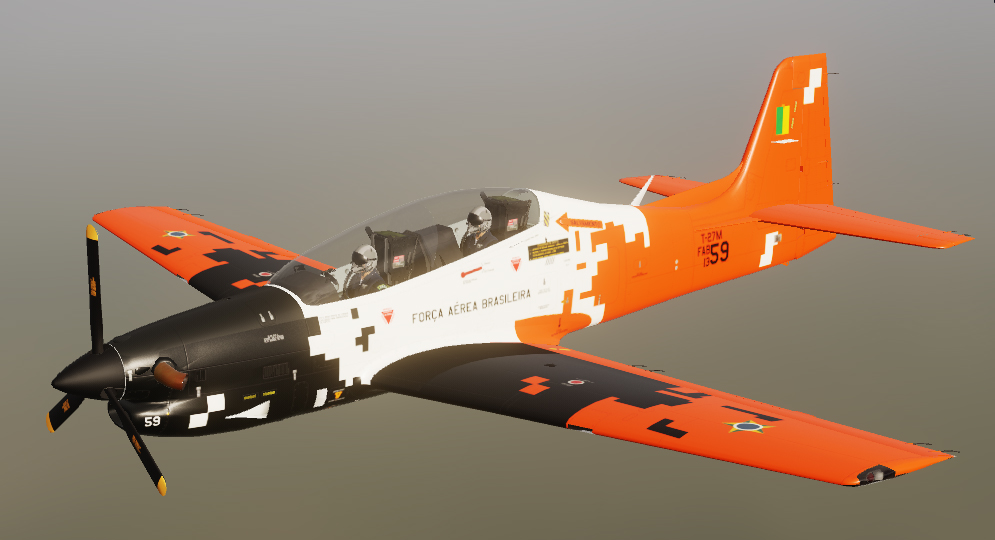
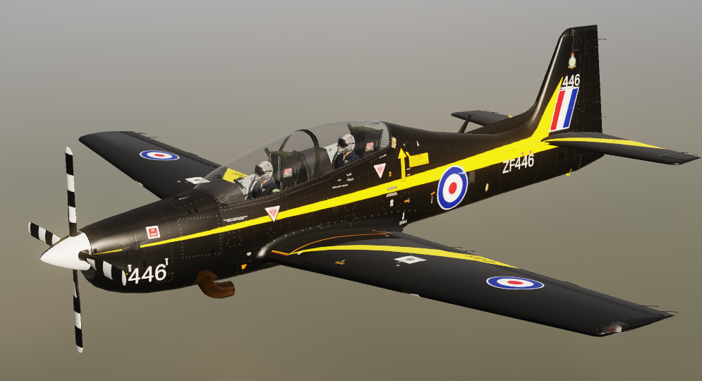
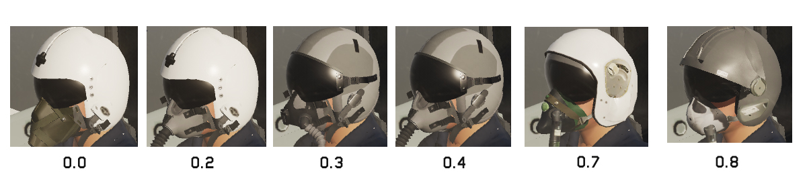
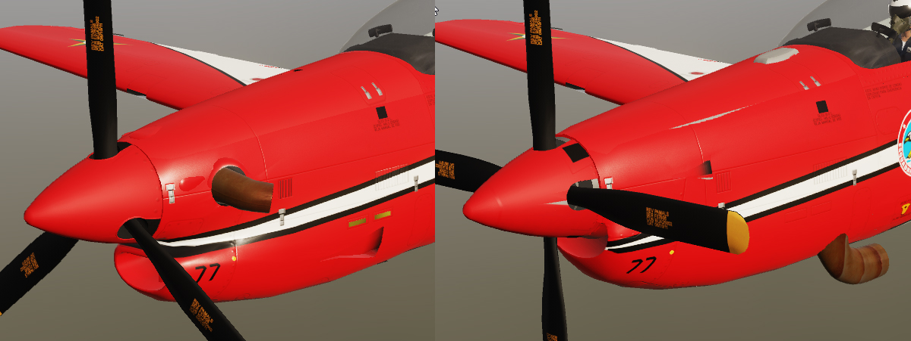

# DCS World Embraer Tucano

Forum - https://forum.dcs.world/topic/387906-embraer-emb-312-tucano-and-variants/

Download in DCS page - https://www.digitalcombatsimulator.com/en/files/3349920/

## EMB-312 Tucano



**Português:** O Embraer EMB-312 Tucano é um avião de treinamento básico de assentos em tandem e motor turboélice, desenvolvido no Brasil no início da década de 1980. Inovador para a sua época, foi uma das primeiras aeronaves de treinamento a oferecer assentos ejetáveis escalonados, um canopy em bolha para excelente visibilidade e um console de instrumentos projetado para simular a sensação de pilotar um caça a jato. É impulsionado por um motor Pratt & Whitney Canada PT6A e tornou-se um grande sucesso de exportação, utilizado por diversas forças aéreas ao redor do mundo.

**English:** The Embraer EMB-312 Tucano is a tandem-seat, turboprop basic trainer aircraft developed in Brazil in the early 1980s. Innovative for its time, it was one of the first training aircraft to offer stepped ejection seats, a bubble canopy for excellent visibility, and an instrument console designed to simulate the feel of flying a jet fighter. Powered by a Pratt & Whitney Canada PT6A engine, it became a massive export success, utilized by numerous air forces around the world.

## Shorts Tucano



**Português:** O Shorts Tucano (oficialmente designado como Tucano T1) é uma versão amplamente modificada do EMB-312 original, fabricada sob licença pela Short Brothers, na Irlanda do Norte, para a Força Aérea Real Britânica (RAF). A principal diferença é a motorização: para atingir os rigorosos requisitos de taxa de subida e velocidade da RAF, a aeronave recebeu um motor Garrett TPE331 muito mais potente, acoplado a uma hélice de quatro pás e escapamentos reposicionados. Além disso, possui fuselagem reforçada, freio aerodinâmico (airbrake) modificado e aviônicos britânicos.

**English:** The Shorts Tucano (officially designated Tucano T1) is a heavily modified version of the original EMB-312, manufactured under license by Short Brothers in Northern Ireland for the British Royal Air Force (RAF). The primary difference is the powerplant: to meet the RAF's stringent climb rate and speed requirements, the aircraft was fitted with a significantly more powerful Garrett TPE331 engine, coupled with a four-bladed propeller and repositioned exhausts. Additionally, it features a strengthened airframe, a modified ventral airbrake, and British avionics.

## EMB-312F

**Português:** O EMB-312F é uma variante especializada do Tucano, customizada especificamente para atender aos requisitos da Força Aérea Francesa (Armée de l'Air). Esta versão incorpora aviônicos de origem francesa (incluindo painéis da Bendix/King), reforços estruturais significativos para aumentar a vida útil da aeronave sob manobras de alto estresse (fadiga) e um sistema de freio aerodinâmico ventral semelhante ao do Shorts Tucano. A aeronave também foi equipada com sistemas avançados de degelo para operar de forma segura no rigoroso clima de inverno europeu.

**English:** The EMB-312F is a specialized variant of the Tucano, customized specifically to meet the requirements of the French Air Force (Armée de l'Air). This version incorporates French-sourced avionics (including Bendix/King panels), significant structural reinforcements to increase the aircraft's fatigue life under high-stress maneuvers, and a ventral airbrake system similar to the Shorts Tucano. The aircraft was also equipped with advanced de-icing systems to operate safely in the harsh European winter climate.

___

# Projeto DCS (Digital Combat Simulator)

**Português:** Atualmente, estou desenvolvendo um projeto do Tucano para o DCS. No momento, a aeronave funciona apenas como IA (Inteligência Artificial). O projeto não possui previsão de término e o desenvolvimento seguirá conforme o tempo livre que eu conseguir dedicar a ele. Estão previstos para o futuro a criação de um painel 3D completo, a implementação de um modelo de voo EFM (External Flight Model), além de modelos detalhados de colisão e dano.

**English:** Currently, I am developing a Tucano project for DCS. At the moment, the aircraft only works as an AI (Artificial Intelligence). The project has no estimated completion date, and development will progress according to the free time I can dedicate to it. Planned future features include a full 3D panel, the implementation of an EFM (External Flight Model), as well as detailed collision and damage models.

___

## Variantes Planejadas / Planned Variants:

* EMB-312 Tucano: Versão original de treinamento básico.

* Shorts Tucano: Versão da RAF com motorização diferente.

* EMB-312F: Versão francesa com aviônicos e reforços específicos.
* 
* EMB-312 Tucano: Original basic training version.

* Shorts Tucano: RAF version with different engines.

* EMB-312F: French version with specific avionics and reinforcements.

___

## 📌 Atualmente, o modelo 3D possui alguns parâmetros básicos configurados para funcionar dentro do ambiente do simulador 

## 📌 Currently, the 3D model has some basic parameters configured to function within the simulator environment.

[x] Modelo 3D externo básico / Basic external 3D model

[x] Implementação como IA no DCS / Implementation as AI in DCS

[ ] Painel 3D completo e clicável (Em desenvolvimento) / Full clickable 3D panel (Under development)

[ ] Modelo de Voo Externo (EFM) / External Flight Model (EFM)

[ ] Modelo de colisão e dano (Damage Model) / Collision and damage model

[ ] Sistemas de rádio e navegação / Radio and navigation systems

[ ] Texturas e Liveries de várias Forças Aéreas / Textures and liveries for various Air Forces

___

## ⚙️ Instalação / Installation

(Instruções para quando o mod estiver jogável/testável)

1. Faça o download da última versão em Releases.

2. Extraia o arquivo .zip.

3. Mova a pasta extraída para o diretório de mods salvos do DCS:

```txt
C:\Users\SEU_USUARIO\Saved Games\DCS\Mods\aircraft\
```

4. Inicie o DCS World e a aeronave estará disponível no editor de missões.


(Instructions for when the mod is playable/testable)

1. Download the latest version from Releases.

2. Extract the .zip file.

3. Move the extracted folder to the DCS saved mods directory:

```txt C:\Users\YOUR_USERNAME\Saved Games\DCS\Mods\aircraft\

```

4. Launch DCS World and the aircraft will be available in the mission editor.

___

# Parameter skins

- Modelo possui algumas variantes de peças:
- The model has several part variations:

```lua
custom_args =
{
	[810] = 0, -- Pilot helmet
	[811] = 0, -- Helmet visor 0-close, 1-open
	[812] = 0, -- Front helmet visor 0-close, 1-open

	[820] = 0, -- Antennas
	[821] = 1, -- Down antenna
	[822] = 0, -- Down antenna
	[823] = 0, -- Top canopy antenna
	[824] = 1, -- Small antenna
	[825] = 0, -- Internal canopy support
	[826] = 0, -- 0: Tucano, 1: Tucano shorts
	[827] = 0, -- Air brake
}
```

* Exemplo capacete no paramentro / Example: helmet in the parameter `[810] = 0, -- Pilot helmet`:



* Exemplo narizo / Example nose `[826] = 0, -- 0: Tucano, 1: Tucano shorts`:



Use o ModelViewer2:0, localizado por exemplo em E:\SteamLibrary\steamapps\common\DCSWorld\bin , para mais detalhes.

Use ModelViewer2:0, located for example in E:\SteamLibrary\steamapps\common\DCSWorld\bin, for more details.

___

## Source of information:

https://historiadafab.rudnei.cunha.nom.br/

https://www.fcm.eti.br/tucano.html

___

## ✉️ Contato

Denis - exemplo@exemplo.com

Link do Projeto: https://github.com/denissoliveira/embraer_tucano_DCS